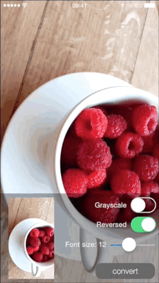
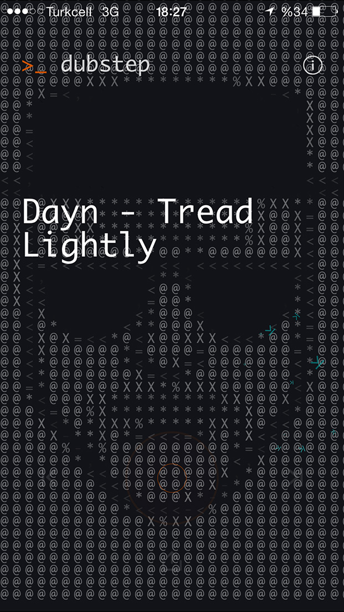
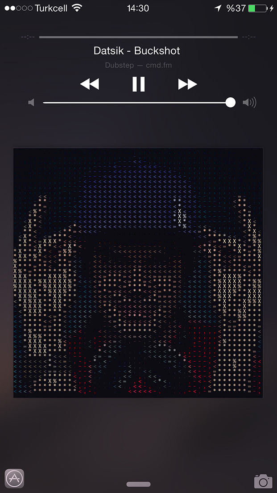
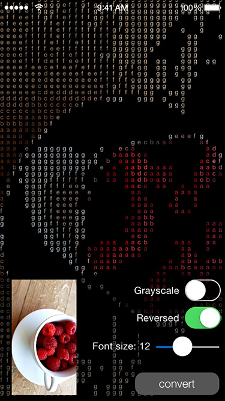

# BKAsciiImage

[](http://cocoapods.org/pods/BKAsciiImage)
[](http://cocoapods.org/pods/BKAsciiImage)
[](http://cocoapods.org/pods/BKAsciiImage)




### As seen on Cmd.fm iOS App

https://itunes.apple.com/app/cmd.fm-radio-for-geeks-hackers/id935765356




## Installation

BKAsciiImage is available through [CocoaPods](http://cocoapods.org). To install it, simply add the following line to your Podfile:

```ruby
pod "BKAsciiImage"
```

## Usage

### Using BKAsciiConverter class

Import BKAsciiConverter header file

```objective-c
#import <BKAsciiImage/BKAsciiConverter.h>
```

Create a BKAsciiConverter instance

```objective-c
BKAsciiConverter *converter = [BKAsciiConverter new];
```

Convert synchronously

```objective-c
UIImage *inputImage = [UIImage imageNamed:@"anImage"];
UIImage *asciiImage = [converter convertImage:inputImage];
```

Convert in the background providing a completion block. 
Completion block will be called on the main thread.

```objective-c
[converter convertImage:self.inputImage completionHandler:^(UIImage *asciiImage) {
	// do whatever you want with the resulting asciiImage
}];
```

Convert to NSString
```objective-c
NSLog(@"%@",[converter convertToString:self.inputImage]);

// asynchronous
[converter convertToString:self.inputImage completionHandler:^(NSString *asciiString) {
    NSLog(@"%@",asciiString);
}];
```

#### Converter options

```objective-c
converter.backgroundColor = [UIColor whiteColor]; // default: Clear color. Image background is transparent
converter.grayscale = YES; // default: NO
converter.font = [UIFont fontWithName:@"Monaco" size:13.0]; // default: System font of size 10
converter.reversedLuminance = NO; // Reverses the luminance mapping. Reversing gives better results on a dark bg. default: YES
converter.columns = 50; // By default columns is derived by the font size if not set explicitly
```

### Using UIImage category

Import header file

```objective-c
#import <BKAsciiImage/UIImage+BKAscii.h>
```

Use the provided category methods

```objective-c
UIImage *inputImage = [UIImage imageNamed:@"anImage"];
[inputImage bk_asciiImageCompletionHandler:^(UIImage *asciiImage) {
        
}];
    
[inputImage bk_asciiStringCompletionHandler:^(NSString *asciiString) {
	
}];

[inputImage bk_asciiImageWithFont: [UIFont fontWithName:@"Monaco" size:13.0]
                          bgColor: [UIColor redColor];
                          columns: 30
                         reversed: YES
                        grayscale: NO
                completionHandler: ^(NSString *asciiString) {
					// do whatever you want with the resulting asciiImage
				}];
```

## Advanced usage

By default luminance values are mapped to strings using 

```objective-c
NSDictionary *dictionary = @{  @1.0: @" ",
                               @0.95:@"`",
                               @0.92:@".",
                               @0.9 :@",",
                               @0.8 :@"-",
                               @0.75:@"~",
                               @0.7 :@"+",
                               @0.65:@"<",
                               @0.6 :@">",
                               @0.55:@"o",
                               @0.5 :@"=",
                               @0.35:@"*",
                               @0.3 :@"%",
                               @0.1 :@"X",
                               @0.0 :@"@"
                               };
```

You can instantiate a converter with your own mapping dictionary

```objective-c
NSDictionary *dictionary = @{  @1.0: @" ",
                               @0.7 :@"a",
                               @0.65:@"b",
                               @0.6 :@"c",
                               @0.55:@"d",
                               @0.5 :@"e",
                               @0.35:@"f",
                               @0.3 :@"g",
                               @0.1 :@" ",
                               @0.0 :@" "
                               };


BKAsciiConverter *converter = [[BKAsciiConverter alloc] initWithDictionary:dictionary];
UIImage *inputImage = [UIImage imageNamed:@"anImage"];
UIImage *asciiImage = [converter convertImage:inputImage];
```



## Author

Barış Koç, https://github.com/bkoc

## License

BKAsciiImage is available under the MIT license. See the LICENSE file for more info.
